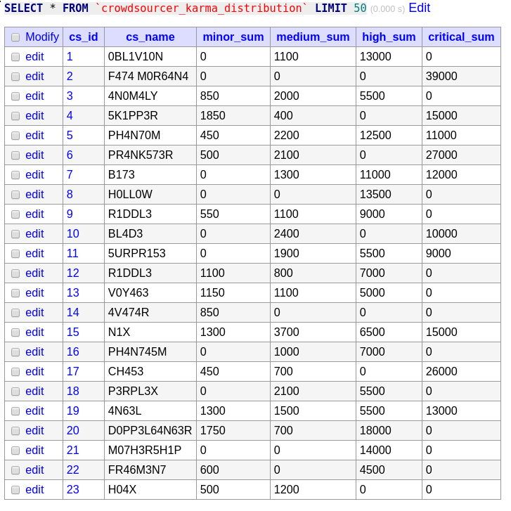

# RabbitMQ Test Pipeline

## Summary

The objective of the pipeline is to calculate the total number of points awarded to each crowdsourcer, as their findings arrive in real-time. 

Points are awarded based on the severity of the findings - the severity of each vulnerability is given in input/vulnerability.csv 

The points to severity mapping is given in input/severity.csv

The name to crowdsourcer ID mapping is given in input/crowdsourcer.csv

The findings are generated as a stream by log\_gen/start\_finding\_stream.py which writes lines to input/finding.csv over time - we use tail -f to stream these to RabbitMQ.

This was a simple test of a RabbitMQ pipeline feeding MariaDB, Cassandra and Redis.

* The log generator ``start_finding_stream.py`` is run on an Alpine Linux Docker container named ``worker`` (based off the Python image).
* On the same container (``worker``) ``tail -f`` is run to get changes to this file in standard output in real-time.
* This is then piped to a Python script (``event_generator.py``) which forwards the rows received as messages to a RabbitMQ exchange (running on the Docker container ``rabbit``).
* On the same Docker container (``worker``), a Python script (``aggregate_karma_updater.py``) is run to receive the messages, parse them as CSV rows and run an update on a MariaDB instance running on the Docker container named ``db``.
* On the same Docker container (``worker``), a Python script (``redis_receive.py``) is run to receive the messages, parse them as CSV rows and run an update on a redis instance running on the Docker container named ``redis``.
* On the same Docker container (``worker``), a Python script (``redis_receive.py``) is run to receive the messages, parse them as CSV rows and run an update on a Redis instance running on the Docker container named ``redis``.
* On the same Docker container (``worker``), a Python script (``cassandra_receive.py``) is run to receive the messages, parse them as CSV rows and run an update on a Cassandra instance running on the Docker container named ``redis``.
* The output is the ``crowdsourcer_karma_distribution`` table on the ``db`` MariaDB instance.
* The databases can be viewed from the Adminer instance running on the Docker container named ``adminer``.

## Execution

### Dependencies

You will need to install Docker and docker-compose, and then run the Docker daemon.

For example, on Arch Linux:

```bash
sudo pacman -S docker
sudo pacman -S docker-compose
sudo systemctl start docker.service
```

In development, the following package versions were used:
```
local/docker 1:18.09.4-1
local/docker-compose 1.23.2-1
```

Also ensure that the ports 3306, 5672, 6379, 8080 and 9042 are free on the host machine for the MariaDB, RabbitMQ, Redis, Adminer and Cassandra services respectively.

### Starting the containers

The commands below are in the startup script ``src/run_docker.sh``, which can be run as follows:
```bash
cd src/
chmod +x ./run_docker.sh
DELAY=20 SECS_PER_DAY=1 ./run_docker.sh
```

Note that you may need to use ``sudo -E`` depending on your Docker configuration:

```bash
SECS_PER_DAY=300 DELAY=90 sudo -E ./run_docker.sh
```

It is recommended to use a minimum delay of 30 seconds due to the slow initialisation of Cassandra.

#### Docker commands

Start the Docker containers with ``docker-compose`` via:

```bash
docker-compose up --build --force-recreate --renew-anon-volumes
```

From the ``src/`` directory. (You may need to use sudo depending on your Docker configuration).

You can also pass two environment variables to the worker:

* **DELAY** : A delay in seconds before the event processing will start (after waiting for the MariaDB server to be ready). Used so that you have time to access Adminer before the events start. Default value: 20
* **SECS\_PER\_DAY** : The seconds per day parameter for log generation, so you can set it to a larger value (i.e. 150) to see events arrive more slowly. Default value: 1

For example (using sudo):

```bash
SECS_PER_DAY=300 DELAY=90 sudo -E docker-compose up --build --force-recreate --renew-anon-volumes
```

You may need to grant Docker permissions to create the shared volumes.

After halting the containers, the following commands should be run:

```bash
sudo docker-compose down
rm -f ../input/finding.csv
```

To ensure the containers will be recreated when next brought up.
Deleting the finding.csv file also ensures that ``tail -f`` works correctly in the next run (since it is shared in a volume).

### Monitoring

The database can be viewed from the Adminer instance, the credentials are:

System: MySQL  
Server: ``db``  
Username: ``root``  
Password: ``groot``  
Database: ``rmqtest``

Specifically, the URL for the ``crowdsourcer_karma_distribution`` table will be:  
<http://127.0.0.1:8080/?server=db&username=root&db=rmqtest&select=crowdsourcer_karma_distribution>




You could also connect to the MariaDB instance directly with a MySQL client i.e.:

```bash
mysql rmqtest -h 127.0.0.1 -u root -p
```

The findings rows generated are also sent to the standard output of the ``worker`` container, and should be visible in the TTY where you run ``docker-compose up``.

### Cleanup

After having finished with the pipeline, it is recommended to remove all the unused images and containers with:

```bash
docker system prune -a
```

## Implementation Overview

The directory structure for the pipeline is as follows:

```
.
|-- check_redis_cassandra.ipynb - Jupyter notebook for checking Redis and Cassandra aggregates
|-- docker-compose.yml - docker-compose configuration
|-- dockerfile - dockerfile for worker container
|-- .env - default values for environment variables
|-- init.sql - SQL to be run on startup of MariaDB container
|-- pipeline
|   |-- aggregate_karma_updater.py - receives messages and updates aggregate table on MariaDB
|   |-- cassandra_receive.py - receives messages and updates aggregate table on Cassandra
|   |-- connections.py - defines connections for MariaDB and RabbitMQ
|   |-- event_generator.py - sends messages from standard input
|   |-- redis_receive.py - receives messages and updates Redis keys for aggregates
|   |-- run_pipeline.sh - waits for MariaDB and runs the pipeline
|   |-- update_karma.sql - query to update karma values for user
|   `-- waitForMySQL.sh - script to wait until MariaDB instance is accepting connections
|-- run_docker.sh - script to start Docker containers and clean up afterwards
`-- requirements.txt - packages to be installed by pip on worker
```

There are a few things to note:

* In the initialisation of the MariaDB container we load all the input files as tables, and initialise the ``crowdsourcer_karma_distribution`` table with zeroes.
* We wait for MariaDB to be ready prior to running the pipeline so that the ``EventGenerator`` also has to wait, otherwise it could start sending messages before the receiver is ready (although the receiver should be able to deal with the backlog).
* We update the whole row in ``crowdsourcer_karma_distribution`` for each update, despite only needing to update one column at a time. Since we are using a row-based backedn for MariaDB this is of no great consequence but does imply that a key-value store could be better for this use case.
* The connection functions for MariaDB and RabbitMQ both have delays and retries in case they are called before the other containers are ready.
* We sleep at the end of the pipeline since there is a small delay between the lines being written by ``start_finding_stream.py`` and these changes being detected by ``tail -f`` and processed as messages. If the worker terminates prematurely the last events would not be processed.

Also note that in the given dataset, the final ID is repeated 3 times, we treat these as separate findings (ignoring the finding ID) - note they have distinct timestamps and vulnerability IDs:

```
worker_1   | 998,2019-02-25 20:17:56,29
worker_1   | 998,2019-02-25 20:57:22,75
worker_1   | 998,2019-02-25 21:03:58,62
```

### Assumptions

We make two major assumptions about the findings data received:

* No new users - all findings we receive are for existing users, so we do not need to handle creating new croudsourcers.
* No name changes - the crowdsourcers never change their names, so we don't have to worry about updating their names (in both tables).


## Discussion Points

### Outages

> How does the pipeline handle outages in its different parts?

* The Docker containers are configured to attempt to restart on failure.
* Durable queues and messages are used in RabbitMQ, so messages which have not been ACKnowledged will be re-sent from disk in the case of failure and restore of the RabbitMQ instance.
* MariaDB also writes to disk and should be able to recover from failure.
* In production, the event generator and the receiver would be on independent machines.
* It is possible to add multiple event producers so that one failure does not halt the process until restart.
* It is possible to have multiple receivers using different queues with the exchange using a round-robin policy and a timeout, so it can continue if one fails.

### Scalability

> How does the pipeline scale with a large increase in input?

* We only save transient messages to disk on RabbitMQ, and only store the aggegate values on MariaDB, so RAM and disk space usage should not increase significantly, assuming there are no outages.
* It is possible to add extra message receiver instances to handle message receipt.
* Main bottleneck likely to be the MariaDB instance due to updating whole rows and committing for each message.
* Due to this, it could be worth using an in-memory key value store rather than MariaDB - so the writes could be faster and keys could be updated one at a time (in this case we only need to update one at a time per message).
* An example of the above would be Cassandra or Redis.
* A stop-gap measure would be to batch updates up to a size limit and time limit, to reduce the number of commits at the cost of the full real-time nature of the output.

### Historic data

> How would the feature request along the lines of: "I want to see the distribution as it was last Wednesday" affect the pipeline?

* Using the fanout exchange we can add another queue that is used to write the logs to S3 for example.
* If the request is infrequent, we could query those logs on S3 using Amazon Athena, Redshift Spectrum (if we have a Redshift cluster) or Presto/Spark on Amazon Elastic Map Reduce.
* Could also consider using Kafka instead of RabbitMQ whcih can store all the event history and replay it.
* Depending on the granularity required, regular database snapshots could also be used.


### Running average

> How would the feature request of a *karma_average* field in the output data set affect the pipeline?

In this case we would have to add two additional columns:

* The total count of hits for the crowdsourcer.
* The running average of the karma for those hits.

We can then update the average using the formula:

$$
\text{new\_average} = \frac{\left ( \left ( \text{old\_average} * \text{old\_count} \right ) + \text{new\_value} \right )}{\text{new\_count}}
$$

This can also be done in a key-value store too.

### Denormalisation

> What are the trade offs with a denormalised output data set in the case of this challenge?

* If names change we could end up with inconsistent data between the ``crowdsourcer`` and ``crowdsourcer_karma_distribution`` tables.
* In the case of this pipeline this could be solved by having a trigger on the ``crowdsourcer`` table to also update the ``crowdsourcer_karma_distribution`` table when the name is changed.
* The denormalisation can be useful in that it can be easier for users to query without joins, and if we exported this table every day, we would have the crowdsourcer name as it was at the time.
* Note that it also requires more disk space on the database - this is insignificant in this challenge, but if we had tens of millions of crowdsourcers, it might be a valid consideration.


## Considerations for production

Finally, there are some things that would need to be changed when trying to put this pipeline into production:

* Default credentials cannot be used - here we can use them because we know it is a proof-of-concept, in production this is a major security risk.
* Credentials cannot be hardcoded - here we do so for simplicity, in production we would need to use a secrets manager to pass them to the containers where required.
* The message generator and receiver should be on independent instances - in this case they are in the same container for simplicity.
* Message parsing should be moved to the event generator side, so we can send messages in a standard form i.e. JSON, and only the part we need (in this case, only the vulnerability ID), and avoid sending any invalid messages.
* Performance should be compared against a key-value store - if we need to deal with a lot of writes to individual columns of individual rows as in this case, this might be the better option. However, it comes at the cost of losing foreign key constraints which would make it harder to maintain consistency with the denormalisation in the output here.
* An integration test should be created to ensure the pipeline works correctly for a known data set.
* The pipeline should be structured as a Python package.

